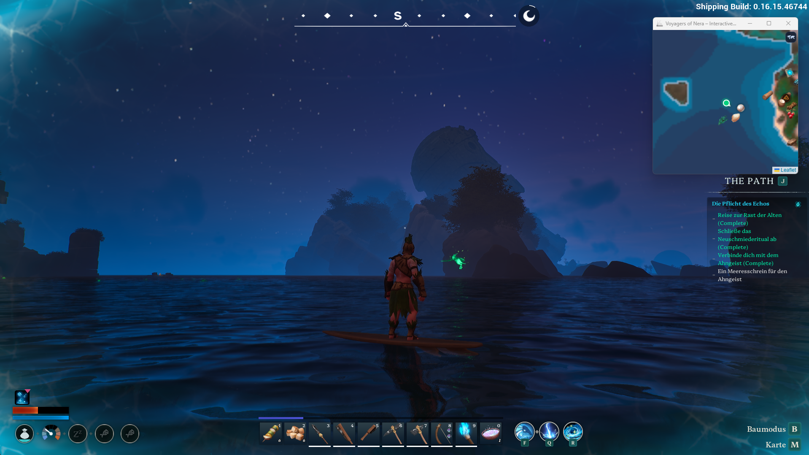

# Voyagers of Nera – Interactive Map

Eine interaktive Karte für **Voyagers of Nera** mit allen wichtigen Ressourcen, Locations und optionaler Live-Spielerposition.
> 🇩🇪 Deutsch · [🇬🇧 English below](#english)
> Erstellt von [OnlyDeko](https://github.com/OnlyDeko) · [Steam](https://steamcommunity.com/profiles/76561198138606543)
---

## ⚠️ Work in Progress

> **Diese Karte befindet sich noch aktiv in Entwicklung.**
>
> - Nicht alle Marker sind vollständig eingetragen — fehlende Locations werden laufend ergänzt
> - Features und Inhalte werden regelmäßig erweitert
>
> Feedback und Verbesserungsvorschläge sind willkommen!
---

## Screenshots

| Gebiet 1 | Gebiet 2 |
|---|---|
|  |  |

| Gebiet 3 | Im Spiel (Minimap-Overlay) |
|---|---|
|  |  |

---

## Download

**[Neueste Version herunterladen](../../releases/latest)**

`VoyagersMap.exe` herunterladen und starten — keine Installation nötig, keine weiteren Dateien erforderlich.

---

## Features

- **2.200+ Marker** — Guide Spirits, Schreine (Feuer / Wind / Wasser / Erde), Monolithen, Markierungen, Ruinen, Kisten, Lore, Ressourcen, Zonen …
- **Marker** für alle 3 Gebiete — Guide Spirits, Schreine (Feuer / Wind / Wasser / Erde), Monolithen, Markierungen, Ruinen, Kisten, Lore, Ressourcen, Zonen …
- **Live-Spielerposition** — Standort + Blickrichtung in Echtzeit via UE4SS-Mod (optional)
- **Minimap-Overlay** — kleines Fenster über dem Spiel, folgt deiner Position (`F10`)
- **Filter-Sidebar** — jede Kategorie einzeln ein-/ausblenden
- **DE / EN** umschaltbar
- **Zonen-Overlay** — Gefahrenbereiche als Flächen auf der Karte
- **Eigene Marker** — Rechtsklick auf die Karte setzt einen eigenen Marker mit Name und Icon.

---

## Installation

1. `VoyagersMap.exe` aus den [Releases](../../releases/latest) herunterladen
2. Irgendwo ablegen (Desktop, Downloads, egal) und starten
3. Fertig — die App speichert ihre Daten automatisch unter `%LocalAppData%\VoyagersMap\`
2. Irgendwo ablegen und starten
3. Fertig — Daten werden automatisch unter `%LocalAppData%\VoyagersMap\` gespeichert

**Voraussetzungen:** Windows 10 / 11 (64-bit) · Microsoft Edge oder WebView2 Runtime (auf Windows 11 vorinstalliert, auf Windows 10 ggf. automatisch installiert)

---

## Live-Position (optional)

Für die Live-Spielerposition wird die **UE4SS-Mod** benötigt:
## Live-Position (optional)

1. [UE4SS für Voyagers of Nera](https://www.nexusmods.com/voyagersofnera/mods/9) installieren
2. Spiel starten → grüner Punkt auf der Karte zeigt deine Position in Echtzeit
1. **[UE4SS für Voyagers of Nera](https://www.nexusmods.com/voyagersofnera/mods/9)** von Nexus installieren
2. **`VoyagersMapDump_Mod.zip`** aus den [Releases](../../releases/latest) herunterladen und entpacken
3. `VoyagersMapDump`-Ordner nach `BoatGame\Binaries\Win64\ue4ss\Mods\` kopieren
4. Spiel neu starten → grüner Pfeil auf der Karte zeigt deine Position live

Ohne Mod funktioniert die Karte vollständig — nur ohne Live-Position.

---

## Shortcuts 
## Shortcuts

| Taste | Funktion |
|-------|----------|
| `F10` | Minimap-Modus umschalten (globaler Hotkey, auch wenn das Spiel fokussiert ist) |
| `M` | Filter-Sidebar ein-/ausblenden |
| Rechtsklick auf Karte | Eigenen Marker setzen |
| `Esc` | Marker-Dialog schließen |

Spiel im **Randlos-Fenster-Modus (Borderless Windowed)** starten, damit das Minimap-Overlay sichtbar bleibt.
Spiel im **Randlos-Fenster-Modus** starten, damit das Overlay sichtbar bleibt.

---

## Rechtliches / Legal
## Rechtliches

Dieses Tool ist ein inoffizielles Fan-Projekt ohne Verbindung zu den Entwicklern von Voyagers of Nera.
Alle Spielinhalte und Assets sind Eigentum der jeweiligen Rechteinhaber.

Siehe [DISCLAIMER.md](DISCLAIMER.md) für den vollständigen rechtlichen Hinweis.
Siehe [DISCLAIMER.md](DISCLAIMER.md).

---

## Credits

- [RE-UE4SS](https://github.com/UE4SS-RE/RE-UE4SS) — Lua-Modding-Framework (MIT)
- UE4SS-Paket für VoN von Ogato ([Nexus Mod #9](https://www.nexusmods.com/voyagersofnera/mods/9))
- Kartendaten & Icons aus dem Spiel gehören Treehouse Games — Fan-Tool, keine offizielle Software

---

# Voyagers of Nera – Interactive Map 🇬🇧

An interactive map for **Voyagers of Nera** with markers for all major resources, locations, and optional live player tracking.

Created by [OnlyDeko](https://github.com/OnlyDeko)

---

## ⚠️ Work in Progress

> **This map is still actively in development.**
>
> - Not all markers have been added yet — missing locations are being added continuously
> - Features and content are regularly expanded
>
> Feedback and suggestions are welcome!
---

## Download

**[Download latest release](../../releases/latest)**

Download `VoyagersMap.exe` and run it — no installation required.

---

## Features

- **Markers** for all 3 regions — Guide Spirits, Shrines (Fire / Wind / Water / Earth), Monoliths, Markings, Ruins, Chests, Lore, Resources, Zones …
- **Live player position** — real-time location + heading via UE4SS mod (optional)
- **Minimap overlay** — small window above the game, follows your position (`F10`)
- **Filter sidebar** — toggle each category individually
- **Zone overlay** — danger areas displayed as map regions
- **Custom Markers** — Right-click on the map to place a custom marker with a name and icon.
---

## Installation

1. Download `VoyagersMap.exe` from [Releases](../../releases/latest)
2. Place it anywhere and run it
3. Done — data is saved automatically to `%LocalAppData%\VoyagersMap\`

**Requirements:** Windows 10 / 11 (64-bit) · WebView2 Runtime (pre-installed on Windows 11)

---

## Live Position (optional)

1. Install **[UE4SS for Voyagers of Nera](https://www.nexusmods.com/voyagersofnera/mods/9)** from Nexus
2. Download **`VoyagersMapDump_Mod.zip`** from [Releases](../../releases/latest) and extract it
3. Copy the `VoyagersMapDump` folder to `BoatGame\Binaries\Win64\ue4ss\Mods\`
4. Restart the game → a green arrow on the map shows your position live

The map works fully without the mod — just without live position.

---

## Shortcuts

| Key | Function |
|-----|----------|
| `F10` | Toggle minimap mode |
| `M` | Toggle filter sidebar |
| Right click on Map | Custom Marker set |
| `Esc` | Marker-Dialog close |

Run the game in **Borderless Windowed** mode so the overlay stays visible.

---

## Legal

Unofficial fan project with no affiliation to the developers of Voyagers of Nera.
All game content and assets are property of their respective owners.
See [DISCLAIMER.md](DISCLAIMER.md).

---

## Credits

- [RE-UE4SS](https://github.com/UE4SS-RE/RE-UE4SS) — Lua modding framework (MIT)
- UE4SS package for VoN by Ogato ([Nexus Mod #9](https://www.nexusmods.com/voyagersofnera/mods/9))
